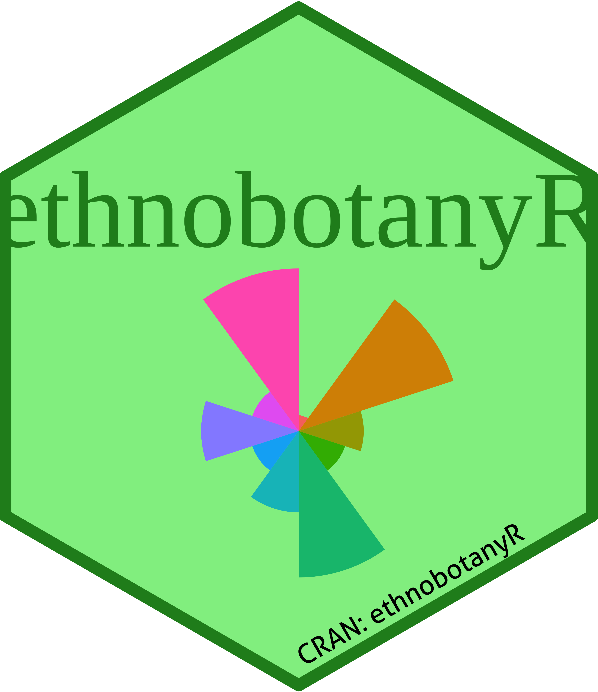
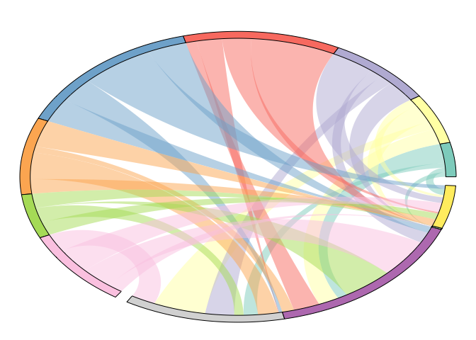
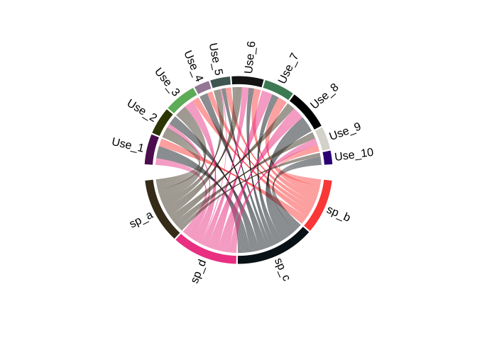

<!-- README.md is generated from README.Rmd. Please edit that file -->

<!-- Spelling -->

<!-- The ABC √ option (upper right on the Rmarkdown console)-->

<!-- Grammar -->

<!-- devtools::install_github("ropenscilabs/gramr") -->

<!-- run_grammar_checker("Hex_sticker.Rmd”) -->

<!-- Print pdf version -->

<!-- rmarkdown::render("README.Rmd", output_format = "pdf_document") -->

# Hex sticker for ethnobotanyR

Cory Whitney [CWWhitney](https://github.com/CWWhitney)

Here is a brief walk-through on how to use a version of the `sticker`
function from `hexSticker` (Yu 2019) to generate the hex sticker for the
`ethnobotanyR` package (Whitney
2019).

<!-- Links: start -->

| Quick Links                                                                                    |
| :--------------------------------------------------------------------------------------------- |
| [**Generate a sticker**](https://github.com/CWWhitney/Hex_%20_stickers#Generate%20a%20sticker) |
| [**Bordeless sticker**](https://github.com/CWWhitney/Hex_%20_stickers#Bordeless%20sticker)     |
| [**Small sticker**](https://github.com/CWWhitney/Hex_%20_stickers##Small%20sticker)            |

<!-- Links: end -->

Create a version of the `sticker` function from `hexSticker`. The new
function is, quite originally, named
`hex_sticker`.

``` r
hex_sticker <-function (subplot, s_x = 0.8, s_y = 0.75, s_width = 0.4, s_height = 0.5, 
    package, p_x = 1, p_y = 1.4, p_color = "#FFFFFF", p_family = "Aller_Rg", 
    p_size = 8, h_size = 1.2, h_fill = "#1881C2", h_color = "#87B13F", 
    spotlight = FALSE, l_x = 1, l_y = 0.5, l_width = 3, l_height = 3, 
    l_alpha = 0.4, url = "", u_x = 1, u_y = 0.08, u_color = "black", 
    u_family = "Aller_Rg", u_size = 1.5, u_angle = 30, white_around_sticker = FALSE, 
    ..., filename = paste0(package, ".png"), asp = 1, dpi = 2000) 
{
    hex <- ggplot() + geom_hexagon(size = h_size, fill = h_fill, 
        color = NA)
    if (inherits(subplot, "character")) {
        d <- data.frame(x = s_x, y = s_y, image = subplot)
        sticker <- hex + geom_image(aes_(x = ~x, y = ~y, image = ~image), 
            d, size = s_width, asp = asp)
    }
    else {
        sticker <- hex + geom_subview(subview = subplot, x = s_x, 
            y = s_y, width = s_width, height = s_height)
    }
    sticker <- sticker + geom_hexagon(size = h_size, fill = NA, 
        color = h_color)
    if (spotlight) 
        sticker <- sticker + geom_subview(subview = spotlight(l_alpha), 
            x = l_x, y = l_y, width = l_width, height = l_height)
    sticker <- sticker + geom_pkgname(package, p_x, p_y, p_color, 
        p_family, p_size, ...)
    sticker <- sticker + geom_url(url, x = u_x, y = u_y, color = u_color, 
        family = u_family, size = u_size, angle = u_angle)
    if (white_around_sticker) 
        sticker <- sticker + white_around_hex(size = h_size)
    sticker <- sticker + theme_sticker(size = h_size)
    save_sticker(filename, sticker, dpi = dpi)
    invisible(sticker)
}
```

Create a small data set for the plot in the middle of the sticker.

``` r
eth_data <- data.frame(variable = as.factor(1:10),
                 value = sample(10, replace = TRUE))
```

Use the `coord_polar` function from `ggplot2` to make the central chord
bar plot (Wickham et al. 2019). Different each time this is run.

``` r
ethnobotanyR_sticker <- ggplot(eth_data, 
  aes(variable, value, fill = variable)) +
  geom_bar(width = 1, stat = "identity") +
  scale_y_continuous(breaks = 0:nlevels(eth_data$variable)) +
  theme_minimal() +
  coord_polar()+ 
  theme_void() + 
  theme_transparent() + 
  theme(legend.position="none")
```


# Generate a sticker

Generate a png file of the hex sticker using the new `hex_sticker`
function.

``` r
hex_sticker(ethnobotanyR_sticker, p_size=6, s_x=1, s_y=.75, s_width=1.5, s_height=1.2, h_fill = "lightgreen", h_color = "forestgreen", p_family = "serif", p_color = "forestgreen", package="ethnobotanyR", url = "CRAN: ethnobotanyR", u_size = 2)
```

## Bordeless sticker



### Securely bordeless


## Small sticker


# Chord diagrams for future stickers

Create a simple chord plot in R (R Core Team 2019) and use colors from
`RColorBrewer` to fill the connections (Neuwirth
2014).



The `ethnobotanyR` package also has options for producing chord diagrams
with (Gu 2019) that may be part of future stickers (Whitney 2019). Here
is an example with the built-in data set
`ethnobotanydata`.

``` r
ethno_chord_plot_sticker_mid <- ethnoChord(ethnobotanydata, by = "sp_name")
```

<!-- -->

# References

<div id="refs" class="references">

<div id="ref-R-circlize">

Gu, Zuguang. 2019. *Circlize: Circular Visualization*.
<https://CRAN.R-project.org/package=circlize>.

</div>

<div id="ref-R-RColorBrewer">

Neuwirth, Erich. 2014. *RColorBrewer: ColorBrewer Palettes*.
<https://CRAN.R-project.org/package=RColorBrewer>.

</div>

<div id="ref-R-base">

R Core Team. 2019. *R: A Language and Environment for Statistical
Computing*. Vienna, Austria: R Foundation for Statistical Computing.
<https://www.R-project.org/>.

</div>

<div id="ref-R-ethnobotanyR">

Whitney, Cory. 2019. *EthnobotanyR: Calculate Quantitative Ethnobotany
Indices*. <https://CRAN.R-project.org/package=ethnobotanyR>.

</div>

<div id="ref-R-ggplot2">

Wickham, Hadley, Winston Chang, Lionel Henry, Thomas Lin Pedersen,
Kohske Takahashi, Claus Wilke, Kara Woo, and Hiroaki Yutani. 2019.
*Ggplot2: Create Elegant Data Visualisations Using the Grammar of
Graphics*. <https://CRAN.R-project.org/package=ggplot2>.

</div>

<div id="ref-R-hexSticker">

Yu, Guangchuang. 2019. *HexSticker: Create Hexagon Sticker in R*.
<https://CRAN.R-project.org/package=hexSticker>.

</div>

</div>
